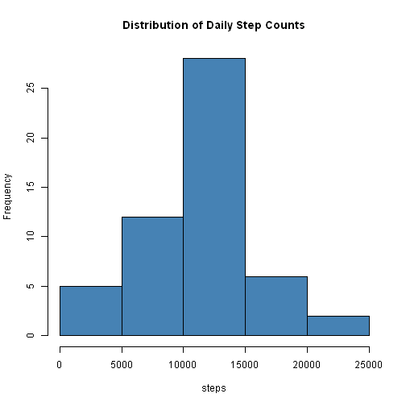
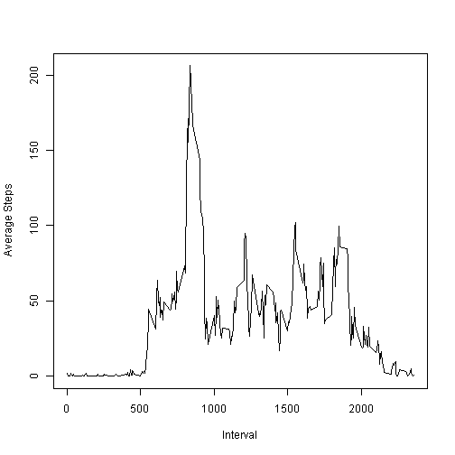
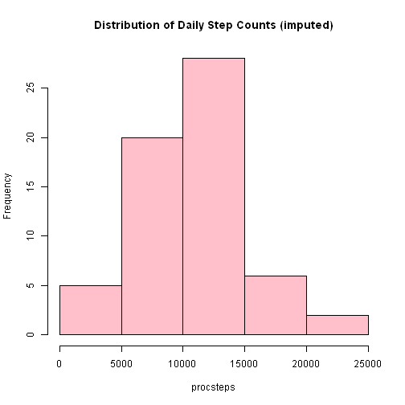
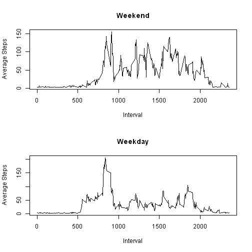

Reproducible Research: Peer Assessment 1 (bbakerharvey)
=======================================================

## Loading and preprocessing the data
First we have to load the data.  Since it is presented as a 
Zip (archive) file format, it must be unzipped, then loaded
into the working data.frame in R.  We plan to use data.table
funcitons, so convert to data.table format, too.


```r
library("data.table")
unzip("activity.zip")
stepdata <- data.table(read.table("activity.csv",sep=",",
                                  header=TRUE))
str(stepdata)
```

```
## Classes 'data.table' and 'data.frame':	17568 obs. of  3 variables:
##  $ steps   : int  NA NA NA NA NA NA NA NA NA NA ...
##  $ date    : Factor w/ 61 levels "2012-10-01","2012-10-02",..: 1 1 1 1 1 1 1 1 1 1 ...
##  $ interval: int  0 5 10 15 20 25 30 35 40 45 ...
##  - attr(*, ".internal.selfref")=<externalptr>
```
The raw data has been loaded into the data.frame stepdata.

Since we know we have NA values in the dataset, first let's look
at exploring the data with the NA values removed.


```r
stripna=stepdata[!is.na(stepdata$steps),]
str(stripna)
```

```
## Classes 'data.table' and 'data.frame':	15264 obs. of  3 variables:
##  $ steps   : int  0 0 0 0 0 0 0 0 0 0 ...
##  $ date    : Factor w/ 61 levels "2012-10-01","2012-10-02",..: 2 2 2 2 2 2 2 2 2 2 ...
##  $ interval: int  0 5 10 15 20 25 30 35 40 45 ...
##  - attr(*, ".internal.selfref")=<externalptr>
```
## What is daily total number of steps taken?

Using the abbreviated dataset, lets look at the total steps
reported for each day.  In table form this is:


```r
library("plyr")
withdaily <- ddply(stripna,~date,summarise, dailysteps=sum(steps))
str(withdaily)
```

```
## 'data.frame':	53 obs. of  2 variables:
##  $ date      : Factor w/ 61 levels "2012-10-01","2012-10-02",..: 2 3 4 5 6 7 9 10 11 12 ...
##  $ dailysteps: int  126 11352 12116 13294 15420 11015 12811 9900 10304 17382 ...
```

```r
withdaily
```

```
##          date dailysteps
## 1  2012-10-02        126
## 2  2012-10-03      11352
## 3  2012-10-04      12116
## 4  2012-10-05      13294
## 5  2012-10-06      15420
## 6  2012-10-07      11015
## 7  2012-10-09      12811
## 8  2012-10-10       9900
## 9  2012-10-11      10304
## 10 2012-10-12      17382
## 11 2012-10-13      12426
## 12 2012-10-14      15098
## 13 2012-10-15      10139
## 14 2012-10-16      15084
## 15 2012-10-17      13452
## 16 2012-10-18      10056
## 17 2012-10-19      11829
## 18 2012-10-20      10395
## 19 2012-10-21       8821
## 20 2012-10-22      13460
## 21 2012-10-23       8918
## 22 2012-10-24       8355
## 23 2012-10-25       2492
## 24 2012-10-26       6778
## 25 2012-10-27      10119
## 26 2012-10-28      11458
## 27 2012-10-29       5018
## 28 2012-10-30       9819
## 29 2012-10-31      15414
## 30 2012-11-02      10600
## 31 2012-11-03      10571
## 32 2012-11-05      10439
## 33 2012-11-06       8334
## 34 2012-11-07      12883
## 35 2012-11-08       3219
## 36 2012-11-11      12608
## 37 2012-11-12      10765
## 38 2012-11-13       7336
## 39 2012-11-15         41
## 40 2012-11-16       5441
## 41 2012-11-17      14339
## 42 2012-11-18      15110
## 43 2012-11-19       8841
## 44 2012-11-20       4472
## 45 2012-11-21      12787
## 46 2012-11-22      20427
## 47 2012-11-23      21194
## 48 2012-11-24      14478
## 49 2012-11-25      11834
## 50 2012-11-26      11162
## 51 2012-11-27      13646
## 52 2012-11-28      10183
## 53 2012-11-29       7047
```

Let's view this as a histogram:

```r
hist(withdaily$dailysteps,xlab="steps",
     main="Distribution of Daily Step Counts", col="steelblue")
```

 

Most days seem to be 10,000 to 15,000 steps.

## What is mean total number of steps taken per day?

To see more about daily steps, let's compute mean and median
of the daily step counts


```r
dailymean=mean(withdaily$dailysteps)
dailymedian=median(withdaily$dailysteps)

cat(sprintf("mean number of steps is %f and median is %f\n",
            dailymean,dailymedian))
```

```
## mean number of steps is 10766.188679 and median is 10765.000000
```


## What is the average daily activity pattern?

Consider the average activity pattern for different times during the day.  


```r
dailypattern <- ddply(stripna,~interval,summarise, 
                      periodsteps=mean(steps))
str(dailypattern)
```

```
## 'data.frame':	288 obs. of  2 variables:
##  $ interval   : int  0 5 10 15 20 25 30 35 40 45 ...
##  $ periodsteps: num  1.717 0.3396 0.1321 0.1509 0.0755 ...
```
So let's look at this as a time series plot:


```r
plot(dailypattern$interval,dailypattern$periodsteps,
     xlab="Interval",ylab="Average Steps",
     type="l")
```

 

In the graph, there appears to be a peak value.


```r
highest = max(dailypattern$periodsteps)
which = dailypattern$interval[dailypattern$periodsteps==highest]

cat(sprintf("peak value of %f is found in interval %5.0f\n",
            highest,which))
```

```
## peak value of 206.169811 is found in interval   835
```


## Imputing missing values

We know our data set had some missing values, which we have
omitted from the analysis until now.  Now let's consider
filling in those blank observations as we consider looking
at weekly patterns.  For the analysis we will use a simple
strategy of replacing the NA with an average number of
steps for the missing interval.  Call this processed step count
procsteps.


```r
avgvals<- dailypattern$periodsteps
str(avgvals)
```

```
##  num [1:288] 1.717 0.3396 0.1321 0.1509 0.0755 ...
```

```r
avgvals
```

```
##   [1]   1.71698   0.33962   0.13208   0.15094   0.07547   2.09434   0.52830
##   [8]   0.86792   0.00000   1.47170   0.30189   0.13208   0.32075   0.67925
##  [15]   0.15094   0.33962   0.00000   1.11321   1.83019   0.16981   0.16981
##  [22]   0.37736   0.26415   0.00000   0.00000   0.00000   1.13208   0.00000
##  [29]   0.00000   0.13208   0.00000   0.22642   0.00000   0.00000   1.54717
##  [36]   0.94340   0.00000   0.00000   0.00000   0.00000   0.20755   0.62264
##  [43]   1.62264   0.58491   0.49057   0.07547   0.00000   0.00000   1.18868
##  [50]   0.94340   2.56604   0.00000   0.33962   0.35849   4.11321   0.66038
##  [57]   3.49057   0.83019   3.11321   1.11321   0.00000   1.56604   3.00000
##  [64]   2.24528   3.32075   2.96226   2.09434   6.05660  16.01887  18.33962
##  [71]  39.45283  44.49057  31.49057  49.26415  53.77358  63.45283  49.96226
##  [78]  47.07547  52.15094  39.33962  44.01887  44.16981  37.35849  49.03774
##  [85]  43.81132  44.37736  50.50943  54.50943  49.92453  50.98113  55.67925
##  [92]  44.32075  52.26415  69.54717  57.84906  56.15094  73.37736  68.20755
##  [99] 129.43396 157.52830 171.15094 155.39623 177.30189 206.16981 195.92453
## [106] 179.56604 183.39623 167.01887 143.45283 124.03774 109.11321 108.11321
## [113] 103.71698  95.96226  66.20755  45.22642  24.79245  38.75472  34.98113
## [120]  21.05660  40.56604  26.98113  42.41509  52.66038  38.92453  50.79245
## [127]  44.28302  37.41509  34.69811  28.33962  25.09434  31.94340  31.35849
## [134]  29.67925  21.32075  25.54717  28.37736  26.47170  33.43396  49.98113
## [141]  42.03774  44.60377  46.03774  59.18868  63.86792  87.69811  94.84906
## [148]  92.77358  63.39623  50.16981  54.47170  32.41509  26.52830  37.73585
## [155]  45.05660  67.28302  42.33962  39.88679  43.26415  40.98113  46.24528
## [162]  56.43396  42.75472  25.13208  39.96226  53.54717  47.32075  60.81132
## [169]  55.75472  51.96226  43.58491  48.69811  35.47170  37.54717  41.84906
## [176]  27.50943  17.11321  26.07547  43.62264  43.77358  30.01887  36.07547
## [183]  35.49057  38.84906  45.96226  47.75472  48.13208  65.32075  82.90566
## [190]  98.66038 102.11321  83.96226  62.13208  64.13208  74.54717  63.16981
## [197]  56.90566  59.77358  43.86792  38.56604  44.66038  45.45283  46.20755
## [204]  43.67925  46.62264  56.30189  50.71698  61.22642  72.71698  78.94340
## [211]  68.94340  59.66038  75.09434  56.50943  34.77358  37.45283  40.67925
## [218]  58.01887  74.69811  85.32075  59.26415  67.77358  77.69811  74.24528
## [225]  85.33962  99.45283  86.58491  85.60377  84.86792  77.83019  58.03774
## [232]  53.35849  36.32075  20.71698  27.39623  40.01887  30.20755  25.54717
## [239]  45.66038  33.52830  19.62264  19.01887  19.33962  33.33962  26.81132
## [246]  21.16981  27.30189  21.33962  19.54717  21.32075  32.30189  20.15094
## [253]  15.94340  17.22642  23.45283  19.24528  12.45283   8.01887  14.66038
## [260]  16.30189   8.67925   7.79245   8.13208   2.62264   1.45283   3.67925
## [267]   4.81132   8.50943   7.07547   8.69811   9.75472   2.20755   0.32075
## [274]   0.11321   1.60377   4.60377   3.30189   2.84906   0.00000   0.83019
## [281]   0.96226   1.58491   2.60377   4.69811   3.30189   0.64151   0.22642
## [288]   1.07547
```

```r
stepdata$isna <- is.na(stepdata$steps)
stepdata$procsteps <- 0.0 + stepdata$steps
loopmax <- length(stepdata$date)
print(loopmax)
```

```
## [1] 17568
```

```r
for (i in 1:loopmax) {
        if (stepdata[i]$isna) {
                stepdata[i]$procsteps <- 
                        dailymean / ( 2400.0 / 5.0)
                }
        }
str(stepdata)
```

```
## Classes 'data.table' and 'data.frame':	17568 obs. of  5 variables:
##  $ steps    : int  NA NA NA NA NA NA NA NA NA NA ...
##  $ date     : Factor w/ 61 levels "2012-10-01","2012-10-02",..: 1 1 1 1 1 1 1 1 1 1 ...
##  $ interval : int  0 5 10 15 20 25 30 35 40 45 ...
##  $ isna     : logi  TRUE TRUE TRUE TRUE TRUE TRUE ...
##  $ procsteps: num  22.4 22.4 22.4 22.4 22.4 ...
##  - attr(*, ".internal.selfref")=<externalptr>
```

### For this new imputed dataset, consider the daily activity

```r
library("plyr")
procdaily <- ddply(stepdata,~date,summarise,
                   dailyprocsteps=sum(procsteps))
str(procdaily)
```

```
## 'data.frame':	61 obs. of  2 variables:
##  $ date          : Factor w/ 61 levels "2012-10-01","2012-10-02",..: 1 2 3 4 5 6 7 8 9 10 ...
##  $ dailyprocsteps: num  6460 126 11352 12116 13294 ...
```

```r
procdaily
```

```
##          date dailyprocsteps
## 1  2012-10-01           6460
## 2  2012-10-02            126
## 3  2012-10-03          11352
## 4  2012-10-04          12116
## 5  2012-10-05          13294
## 6  2012-10-06          15420
## 7  2012-10-07          11015
## 8  2012-10-08           6460
## 9  2012-10-09          12811
## 10 2012-10-10           9900
## 11 2012-10-11          10304
## 12 2012-10-12          17382
## 13 2012-10-13          12426
## 14 2012-10-14          15098
## 15 2012-10-15          10139
## 16 2012-10-16          15084
## 17 2012-10-17          13452
## 18 2012-10-18          10056
## 19 2012-10-19          11829
## 20 2012-10-20          10395
## 21 2012-10-21           8821
## 22 2012-10-22          13460
## 23 2012-10-23           8918
## 24 2012-10-24           8355
## 25 2012-10-25           2492
## 26 2012-10-26           6778
## 27 2012-10-27          10119
## 28 2012-10-28          11458
## 29 2012-10-29           5018
## 30 2012-10-30           9819
## 31 2012-10-31          15414
## 32 2012-11-01           6460
## 33 2012-11-02          10600
## 34 2012-11-03          10571
## 35 2012-11-04           6460
## 36 2012-11-05          10439
## 37 2012-11-06           8334
## 38 2012-11-07          12883
## 39 2012-11-08           3219
## 40 2012-11-09           6460
## 41 2012-11-10           6460
## 42 2012-11-11          12608
## 43 2012-11-12          10765
## 44 2012-11-13           7336
## 45 2012-11-14           6460
## 46 2012-11-15             41
## 47 2012-11-16           5441
## 48 2012-11-17          14339
## 49 2012-11-18          15110
## 50 2012-11-19           8841
## 51 2012-11-20           4472
## 52 2012-11-21          12787
## 53 2012-11-22          20427
## 54 2012-11-23          21194
## 55 2012-11-24          14478
## 56 2012-11-25          11834
## 57 2012-11-26          11162
## 58 2012-11-27          13646
## 59 2012-11-28          10183
## 60 2012-11-29           7047
## 61 2012-11-30           6460
```

To see more about daily steps, let's compute mean and median
of the imputed daily step counts


```r
procmean=mean(procdaily$dailyprocsteps)
procmedian=median(procdaily$dailyprocsteps)

cat(sprintf("For this proc dataset: mean number of steps is %f and median is %f\n",
            procmean,procmedian))
```

```
## For this proc dataset: mean number of steps is 10201.405011 and median is 10395.000000
```

This can be seen as a histogram:

```r
hist(procdaily$dailyprocsteps,xlab="procsteps",
     main="Distribution of Daily Step Counts (imputed)", 
     col="pink")
```

 


## Are there differences in activity patterns between weekdays and weekends?


```r
vsat <- weekdays(as.Date(stepdata$date)) == "Saturday"
vsun <- weekdays(as.Date(stepdata$date)) == "Sunday"
stepdata$iswe <- vsat | vsun
sum(stepdata$iswe)
```

```
## [1] 4608
```
Compute the weekend and weekday patterns

```r
weekendpattern <- ddply(stepdata[stepdata$iswe==TRUE],~interval
        ,summarise, periodsteps=mean(procsteps))
str(weekendpattern)
```

```
## 'data.frame':	288 obs. of  2 variables:
##  $ interval   : int  0 5 10 15 20 25 30 35 40 45 ...
##  $ periodsteps: num  2.8 2.8 2.8 2.8 2.8 ...
```

```r
weekdaypattern <- ddply(stepdata[stepdata$iswe==FALSE],~interval
        ,summarise, periodsteps=mean(procsteps))
str(weekdaypattern)
```

```
## 'data.frame':	288 obs. of  2 variables:
##  $ interval   : int  0 5 10 15 20 25 30 35 40 45 ...
##  $ periodsteps: num  5.01 3.39 3.15 3.17 3.08 ...
```
Plot the weekend and weekday patterns

```r
par(mfcol=c(2,1))

plot(weekendpattern$interval,weekendpattern$periodsteps,
     xlab="Interval",ylab="Average Steps", main="Weekend",
     type="l")

plot(weekdaypattern$interval,weekdaypattern$periodsteps,
     xlab="Interval",ylab="Average Steps", main="Weekday",
     type="l")
```

 
     
